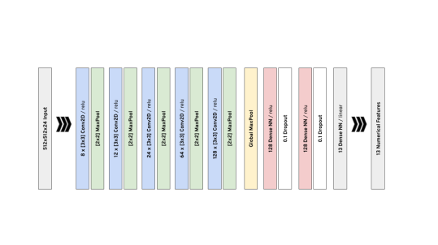
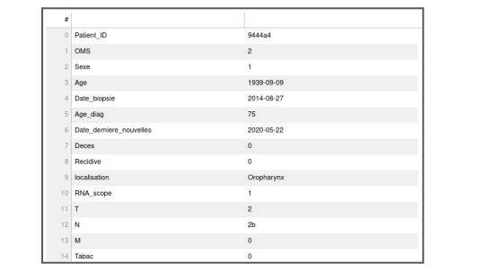

# **A Multimodal Deep Learning Visual Interpretability Framework for Oropharnygeal Cancer Imagery**
### Datategy SAS ###

#### *EPIDEMIUM Challenge ORL/IA : Predicting the evolution of Papillomavirus-induced ENT cancer from pathology section of tumor*

##### PapAI Team participates in Epidemium Season 3 - ORL/IA Challenge. All our members have read and accepted the related terms and conditions. Our contribution in the challenge holds "Creative Commons CC BY 4.0" and "MIT Licence".

##### *Keywords : Deep Learning, Machine Learning Interpretability, GradCAM, Convolutional Neural Networks, Multimodal Stain Processing*

 *To download scientific article format in pdf, poster in pdf and our video in mp4 [Click here](https://drive.google.com/drive/folders/1MY726_B739LA-IE8ys4yp1bSPdzuopqc?usp=sharing)* .

## **1 Introduction**

Our study intends to develop a complete framework to guide researchers and pysicians in understanding the effects of micro-environment in the periphery of HPV+ oropharyngeal cancer tumors. Researchers presuppose that presence of HPV viruses, interaction of immune cells etc. increase the prognostics of the disease. The challenge expects from us to present a system backed by machine learning, which is capable of shedding light on this complex set of pathological relationships by fusing various multiparametric biopsy slides and clinical data of patients. As it is known, the interdependence between the voluminous number of parameters behind the disease is highly involuted. Our challenge task force in Datategy composed of machine learning engineers / data scientists has studied the topic and brainstormed attentively. Considering the intricacy and multimodality of the problem, we are convinced that deep learning shall be at the core of the solution with visual interpretability maps as the resulting human-side interface. Our rigorous study indicates that no existing architecture or methodology can be employed directly for this task. Certain vital reconfigurations need to be applied to state-of-the-art deep learning solutions. In this document, we present the proposed methodology, initial outcomes and our prospects. However, at this point, it is highly important to highlight that our approach needs to be carefully examined by the experts in the field. Further modifications and improvements can be made according to feedback from the committee and collaboration of additional researchers. We believe our work might constitute the seed of a seminal framework for the solution of the intended problem with various originalities and careful propositions in its design, if further collaboration can be conducted in near future.

## **2 Methodology**

The unique constraints and nature of this particular challenge necessitates an innovative approach in deep learning. Our deep learning team has carefully studied the provided details and the corresponding scientific articles in order to find the most suitable application. 

First of all, the main goal of the challenge is to deliver a data scientific / AI backed methodology to researchers in this particular medical field; where they can better understand the dynamics of the microenvironment in the periphery of the tumor on the prognostics of HPV induced ENT cancer. For this purpose, one has to provide ‘pixel-wise’ attention maps of pathology imagery of each patient to ENT oncology researchers. 

However, there are certain highly significant aspects before one starts to conceptualize the approach : 

1.  The inapplicability of conventional computer vision deep learning methods : The popular deep learning models such as VGG-16, ResNet, YOLO, Xception etc. are all developed for general purpose RGB (3-channels) image detection/classification. In our context, using them for transfer learning would be insoluble, where we have dozens of channels (each corresponding to a specific marker). In addition to 3 channels constraint, these models which are trained to classify everyday objects are much deeper to extract very high level visual features. Also they include much larger kernels (7x7, 11x11 etc.) which is not suitable for our case, where we have very small, few pixel size entities such as virus etc. Also, note that, when we use these pre-trained available models for transfer learning, we constrain ourselves to their fixed input image size (VGG-16 224x224 e.g.), however in our case we need much larger input image sizes.

2.  Multimodality of Clinical Statistics : Our deep learning/statistics task force has carefully investigated the details of the challenge. Making a statistical link between the tabular data and the pathology images is much more complex than it seems under this context. In order to develop a visual interpretability model which can direct researchers to better understand which aspects of microenvironment affects the evolution of the disease, we need to make our methodology conform to the multimodal statistical nature of the case. Oncology is inherently highly complex. Numerous diverse parameters shall be in effect together on the progress of the disease. This enforces us not to consider these clinical parameters orthogonally, but as a compound. Therefore, we have decided to design our methodology considering this fact. For instance, we can not simply just take OS (Overall Survival) or whether the patient is dead or not as a single parameter and build our model. For example, if we would build a single visual interpretability model which regresses only on the ‘OS’, then we would achieve erroneous and misleading results. Because, we omit all the rest of the factors (age, sex, smoking habits, etc.) which surely plays an important part on the evolution of the disease. Regressing on only a single or few parameters like this shall make the attention maps (highlighting of pixels of pathology images) deceiving. To better explain, if we regress only on the survivability with our visual deep learning model, and try to interpret the spatial importances; we would not achieve correct results on determining the characteristics of the microenvironment on the prognostics of the disease. Because, as an example, a patient who is smoking severely or highly aged may show a rapid degradation in health, whilst the prospects of micro-environment may still be in his/her favor. Considering these crucial facts, our statistical/AI task force has decided to develop a generic convolutional neural network which regresses on various tabular clinical data. Based on this architecture, we have created a framework to interpret the role of the spatial features of each patient’s multimodal HPV+ oropharyngeal tumor images together with immunologists/pathologists/oncologists.

3.  Multimodality of Imagery: Just like the multimodal inherent nature of clinical data, the same applies to the multiplex pathology imagery of the patients. We can not interpret the effects of different markers orthogonally, hence the proposed methodology shall incorporate the effects of the multiparametric slides coherently. Therefore, the proposed architecture should take all the modalities of the images together (7 different markers of multiplex staining, segmented imagery etc.) Hence, it is indispensable to have a deep learning model where inter-correlations of image modalities are being taken into account. This approach is not just crucial for the validity of the model, but also provides us a new dimension in interpretability. Thanks to this, we can demonstrate the correlations between different stains (also called channels in the document to conform the deep learning glossary). In addition to correlations between channels, we can also understand the correlations between imagery stains and tabular data. 

### **2.1 General Overview of the Proposed Method**

As mentioned previously in the introduction of the document, we have designed a convolutional neural network which regresses on tabular data. Firstly, all the channels (multiplex stains) of an image are concatenated together to produce a single 24-channel image. (8 different compound RGB images - including segmentation - yielding 24 channels.). After rigorous examination a spatial size of 512x512 pixels is found to be the best compromise between model efficacy and the fine granularity of interpretability.

As you know, a patient may have a different number of images labeled with an ID. (e.g. Patient : 9191b7, Image : [11825,55650]). This discrepancy in the number of images for patients necessitates to take a particular action before building the deep learning model. There are several approaches to address this type of cases in machine learning, however considering the size of the dataset and the peculiarities of the problem, we have decided to treat each image as a single sample. At the end, the model takes a 24 channel image and regress on 13 numerical data (features we have chosen, processed and engineered; which will be explained further in the document.) So, each image is a single sample in our framework, and hence, different images of the same patient have the same output features. Of course, we have trained the model only on the training patients and extrapolated results on the test patients separately. Still, we have taken necessary counter-measures to combat overfitting, which will be addressed in next sections.

![Fig. 1. The general architecture of the proposed framework. Each 24-channel image of a patient is passed through a deep convolutional neural network and regresses on its 13 numerical features. After training of the deep learning module, a GradCAM based model is used to calculate spatial attentions on each channel; where the gradients are calculate to maximize the ‘OS’ prediction. Note that, a larger value of the OS indicates a better survivability. Therefore, our interpretability model shows attention maps on the features improving prognostics of the disease.](figures/fig001.svg)

Fig. 1. The general architecture of the proposed framework. Each 24-channel image of a patient is passed through a deep convolutional neural network and regresses on its 13 numerical features. After training of the deep learning module, a GradCAM based model is used to calculate spatial attentions on each channel; where the gradients are calculated to maximize the ‘OS’ prediction. Note that, a larger value of the OS indicates a better survivability. Therefore, our interpretability model shows attention maps on the features improving prognostics of the disease.

We have used extensive image augmentation in training considering the limited data. Up to 10% random spatial cropping/extension, 360 degrees rotation and horizontal-vertical flipping effectuated for each input instance. The model is trained carefully with a closely inspected learning rate, making sure overfit is avoided.

### **2.2 Preprocessing of Tabular Features**

We have processed and engineered new features from the original tabular data. Firstly, the age of a patient at the time of ‘last news’ : ‘age_last_news’ and ‘biopsy’ : ‘age_biopsy’ is calculated. Then, using these, the fractional years passed between biopsy and diagnosis, ‘age_biopsy_since_diag’ and between diagnosis and last news : ‘age_last_news_since_diag’ are calculated. We believe all of these new parameters shall have profound effects on the evolution of the disease.

Following this step, we have numerically encoded certain categorical variables. All of these parameters are inherently ordered in nature (lesser indicating severity or vice versa etc.), thus we have encoded them accordingly. Smoking habit related variable, ‘tabac’, RNA scope variable ‘rna_scope’, ‘T’ and ‘M’, ‘OMS’, ‘OS’ are coded directly with their numerical values. Death and Recidivity variables are binary, so they are coded directly with their own values as well. However, ‘N’ parameter has special sublevels for its 2nd level, but according to challenge guidelines, it still keeps its inherent ordered nature, thus ‘N’ is encoded such as : 
{"0": 0, "1": 1, "2": 2, "2a": 3, "2b": 4, "2c": 5, "3": 6}.

At the end, all 13 features (As expected, the test dataset has no ‘OS’ parameter as it is a feature expected to be predicted for challengers.) are scaled with Standard Scaling. We made sure scaling is only trained with training instances and no validation/test leakage occurs.

### **2.3 Deep Learning Architecture and GradCAM Based Spatio-Channel Interpretability**

#### **2.3.1  Omni-Channel Omni-Covariant Convolutional Deep Learning Architecture**

Our deep learning team has dedicated most of its time for the challenge to design an efficient convolutional neural network architecture for this particular task. The peculiarity of the dataset and the nature of the problem make usage of conventional architecture obsolete. In this conceptualization phase, several aspects played significant roles in our decisions : 

1. Kernel sizes shall be small, 3x3 pixels at most, in all convolutional layers, as there are many few pixel size minuscule features we have to detect.
2. For the same reason, the depth of pooling layers shall not be too profound, as we may lose important information.
3. Only max pooling shall be used after convolutional layers, as small sized entities need to pass their visual features until the last regression layer. Considering this fact, we have also decided to use a global max pooling layer at the end of convolutional layers, rather than flattening neurons. Our deep learning task force has determined that this approach links the smallest visual representations to tabular numerical data and the OS variable.
4. In order to smooth encoded representations and not to keep few-pixel-width visual information out, strides shall be small, 1 pixel in convolutional layers.
5. We have figured out that, for a meaningful visual interpretability, the image size should be at least 512x512 pixels in size.
6. As mentioned previously, regression on OS along with other tabular features is of paramount importance, in this context. Many complex and very probably latent parameters are in effect in the development and prognostics of the disease. Therefore, training a model which learns the perplexed covariations and correlations between all tabular data and visual representations is necessary.
7. Same necessity exists for the channel axes as well, where all visual cues (pathological markers etc.) have to be taken into account by the model. Hence, we designed a convolutional neural network which takes all 24 channels as input (8 modalities x 3 RGB channels). 

Fig. 2. Proposed Convolutional Deep Learning architecture for the challenge, which conforms to all aspects and constraints of the task.

#### **2.3.2  GradCAM Revisited for the Challenge : OS Targeted Multi-Channel Spatial Attention Mapping via Omni-Parametric Tabular Regression**

GRADCam has been one of the most widely adopted methods to induce visual interpretation over convolutional neural networks [1][2]. As expected, as for the complexity of designing a special convolutional neural network due to peculiarity of the case, we also need to design a special visual interpretability framework. Gradient-weighted Class Activation Maps (GradCAM) is a perfect tool for convolutional neural network based explainability thanks to its straight-forwardness and ease of implementation. As the name implies, the central idea is to back trace the positively contributing gradients to the class activation of a given instance [1]. Therefore, we have decided to use it for the challenge. However, note that our case is much more demanding than a simple classification task. 

Considering all the aspects of the intended mission, Datategy Data Science Challenge Team has proposed a novel framework for visual explainability. Our approach bases itself on a modified version of the GradCAM algorithm. First of all, the main goal of the project is to develop a visual interpretability method, most conveniently a pixel-wise heatmap on images, to better understand the dynamics of the microenvironment around tumors on the evolution of oropharynx cancer. It is suggested that HIV+ oropharyngeal cancers may show better prognostics due to several potential factors [3][4]. The challenge aims to verify this by linking multiplex imaging with tabular data of patients. 

As mentioned previously in the document, it is not possible to suggest that just a single variable such as OS can be used for this purpose. Because, numerous hidden and complex dynamics shall determine the progress of the disease, such as age, smoking habit, gender, etc. These constitute just the cofactors. It is also not possible to reduce the outcome of the disease, such as ‘a better prognostic’ etc. to a single tabular parameter. Also, it might not be a good idea to treat different multiplexes of imagery separately, as researchers seek to understand the correlations between them and their effects on the evolution of the disease. On that account, our team developed this visual explainability framework which takes all of these highly multimodal data into account and guides researchers in a more correct and convenient way to interpret the imagery to better understand the effects of microenvironment around the tumor cells. 

Due to the aforementioned multimodal nature of our deep learning architecture, regular GradCAM algorithm is not directly applicable to our case. Note that, we are regressing on all 13 numerical features with a linear activation layer at the end. In order to indıce visual interpretability on the effects of microenvironment on the survivability, prognostics of the disease, we suggest to follow gradients through only on the OS variable. In addition to this, our model takes all the 24 channels into account, where this allows researchers to investigate the correlation between visual markers. The GradCAM algorithm was modified and fine-tuned to conform to these constraints. At the end, the higher attention values on the pixels on the images indicate better prognostics (higher OS) for that particular patient whilst taking into account the importance of ensemble of the tabular data.

In the next section we present the results of our novel framework, which will help reader to better grasp the usage of the proposed method to investigate the effects of the microenvironment on the prognostics of the disease. 

## **3 Results**

### **3.1 Visual Interpretation by Per Patient Case Study**

In order to assess the performance and demonstrate the proper usage of the proposed algorithm, we think the best approach is to investigate the heatmaps of a few patients (both from training and test groups) one by one. We made sure to choose a diverse set of patients to represent different scales of OS, different age, smoking habits etc. to understand how the proposed interpretation system operates to guide the researchers and medical staff to give attention to certain regions on each marker considering clinical and demographic data of patients. 

#### **3.1.1  Patient 8a5e87 / Train Set**

We present the results of our framework for 4 images of the patient. The clinical data of the patient is shown in Table. 1.

Table. 1. Patient 8a5e87 clinical data. The OS of the patient is 80.

##### **Image : [11684,44523] Patient 8a5e87 / Train Set**

One of the advantages of our framework is the ability to show the overall attention given on each of the 24 channels of each type of marker due to the fact that it follows an omni-channel approach, where total positive guided gradient over separate channels can be summed and normalized.  At the end, one can understand the ratio of the importance of each channel. This shows how each channel influences a patient's OS  (0 : Red, 1 : Green, 2 : Blue), also considering all of his/her clinical data as our deep learning architecture is trained to regress on all the 13 numerical features. 

As a further step, after having a general idea on the importance of the contributions of the channels for the overall survivability of the patient, the researcher can inspect the spatial distribution of attention among significant markers, one by one.

![Fig. 3. Patient 8a5e87, Image [11684,44523], ratio of overall importance of each 24 RGB channel.](figures/fig003.svg)

Fig. 3. Patient 8a5e87, Image [11684,44523], ratio of overall importance of each 24 RGB channel.

For each image of each patient, at first we can inspect the overall spatial distribution of attention, averaged across all markers, where brighter pixels correspond to the microenvironmental regions corresponding to higher overall survivability for that particular patient. Note that, our deep learning model regresses on all tabular data simultaneously which makes sure that complex correlations behind the evolution of the disease are included in the process.

Next, we will show the resulting attention maps on important channels and compare it with raw ones to understand the dynamics of the microenvironment. Let us start always by showing the overall attention map, overlaid on the grayscale of raw segmentation image. And we compare it to the original RGB segmentation to have a general idea on the dynamics. The color mapping is shown alongside attention maps, where the hue approaches brighter tones. Note that our modified GradCAM algorithm is bound to OS value, thus indicating higher expected OS for the patient with higher attention values and lower expected OS for lower ones.

![Fig. 4. Patient 8a5e87, Image [11684,44523], overall spatial attention overlaid on grayscale raw segmentation image.](figures/fig004.svg)

Fig. 4. Patient 8a5e87, Image [11684,44523], overall spatial attention overlaid on grayscale raw segmentation image.

![Fig. 5. Patient 8a5e87, Image [11684,44523], original RGB raw segmentation image.](figures/fig005.svg)

Fig. 5. Patient 8a5e87, Image [11684,44523], original RGB raw segmentation image.

Following this introductory general overview, one can investigate the attention maps of each channel one by one to better understand the micro environmental effects.

![Fig. 6. Patient 8a5e87, Image [11684,44523], Attention Map on the Cellul. Tum. Immun. 03 Blue Channel. Note that, this channel dominates the instance’s interpretability values, thus the overall attention map shows a significant correlation with its own individual spatial distribution.](figures/fig006.svg)

Fig. 6. Patient 8a5e87, Image [11684,44523], Attention Map on the Cellul. Tum. Immun. 03 Blue Channel. Note that, this channel dominates the instance’s interpretability values, thus the overall attention map shows a significant correlation with its own individual spatial distribution.

![Fig. 7. Patient 8a5e87, Image [11684,44523], Original Cellul. Tum. Immun. 03 RGB image.](figures/fig007.svg)

Fig. 7. Patient 8a5e87, Image [11684,44523], Original Cellul. Tum. Immun. 03 RGB image.

This channel dominates the instance’s interpretability values, thus the overall attention map shows a significant correlation with its own individual spatial distribution. Followingly, we also show the original RGB images of the corresponding channels.

##### **Image : [12615,43825] Patient 8a5e87 / Train Set**

![Fig. 8. Patient 8a5e87, Image [12615,43825], ratio of overall importance of each 24 RGB channel.](figures/fig008.svg)

Fig. 8. Patient 8a5e87, Image [12615,43825], ratio of overall importance of each 24 RGB channel.

![Fig. 9. Patient 8a5e87, Image [12615,43825], overall spatial attention overlaid on grayscale raw segmentation image.](figures/fig009.svg)

Fig. 9. Patient 8a5e87, Image [12615,43825], overall spatial attention overlaid on grayscale raw segmentation image.

![Fig. 10. Patient 8a5e87, Image [12615,43825], RGB raw segmentation image.](figures/fig010.svg)

Fig. 10. Patient 8a5e87, Image [12615,43825], RGB raw segmentation image.

![Fig. 11. Patient 8a5e87, Image [12615,43825], Cellul. Tum. Immun. 02 Green Channel.](figures/fig011.svg)

Fig. 11. Patient 8a5e87, Image [12615,43825], Cellul. Tum. Immun. 02 Green Channel.

![Fig. 12. Patient 8a5e87, Image [12615,43825], Cellul. Tum. Immun. 05 Red Channel.](figures/fig012.svg)

Fig. 12. Patient 8a5e87, Image [12615,43825], Cellul. Tum. Immun. 05 Red Channel.

##### **Image : [12615,44523] Patient 8a5e87 / Train Set**

![Fig. 13. Patient 8a5e87, Image [12615,44523], ratio of overall importance of each 24 RGB channel.](figures/fig013.svg)

Fig. 13. Patient 8a5e87, Image [12615,44523], ratio of overall importance of each 24 RGB channel.

![Fig. 14. Patient 8a5e87, Image [12615,44523], overall spatial attention overlaid on grayscale raw segmentation image.](figures/fig014.svg)

Fig. 14. Patient 8a5e87, Image [12615,44523], overall spatial attention overlaid on grayscale raw segmentation image.

![Fig. 15. Patient 8a5e87, Image [12615,44523], RGB raw segmentation image.](figures/fig015.svg)

Fig. 15. Patient 8a5e87, Image [12615,44523], RGB raw segmentation image.

![Fig. 16. Patient 8a5e87, Image [12615,44523], Cellul. Tum. Immun. 02 Green Channel.](figures/fig016.svg)

Fig. 16. Patient 8a5e87, Image [12615,44523], Cellul. Tum. Immun. 02 Green Channel.

![Fig. 17. Patient 8a5e87, Image [12615,44523], Original Cellul. Tum. Immun. 02 RGB image.](figures/fig017.svg)

Fig. 17. Patient 8a5e87, Image [12615,44523], Original Cellul. Tum. Immun. 02 RGB image.

![Fig. 18. Patient 8a5e87, Image [12615,44523], Cellul. Tum. Immun. 05 Red Channel.](figures/fig018.svg)

Fig. 18. Patient 8a5e87, Image [12615,44523], Cellul. Tum. Immun. 05 Red Channel.

![Fig. 19. Patient 8a5e87, Image [12615,44523], Raw Segmentation Green Channel.](figures/fig019.svg)

Fig. 19. Patient 8a5e87, Image [12615,44523], Raw Segmentation Green Channel.

![Fig. 20. Patient 8a5e87, Image [12615,44523], Cellul. Tum. Immun. 03 Blue Channel.](figures/fig020.svg)

Fig. 20. Patient 8a5e87, Image [12615,44523], Cellul. Tum. Immun. 03 Blue Channel.

![Fig. 21. Patient 8a5e87, Image [12615,44523], Original Cellul. Tum. Immun. 03 RGB image.](figures/fig021.svg)

Fig. 21. Patient 8a5e87, Image [12615,44523], Original Cellul. Tum. Immun. 03 RGB image.

##### **Image : [11684,45221] Patient 8a5e87 / Train Set**

![Fig. 22. Patient 8a5e87, Image [11684,45221], ratio of overall importance of each 24 RGB channel.](figures/fig022.svg)

Fig. 22. Patient 8a5e87, Image [11684,45221], ratio of overall importance of each 24 RGB channel.

![Fig. 23. Patient 8a5e87, Image [11684,45221], overall spatial attention overlaid on grayscale raw segmentation image.](figures/fig023.svg)

Fig. 23. Patient 8a5e87, Image [11684,45221], overall spatial attention overlaid on grayscale raw segmentation image.

![Fig. 24. Patient 8a5e87, Image [11684,45221], Cellul. Tum. Immun. 01 Green Channel.](figures/fig024.svg)

Fig. 24. Patient 8a5e87, Image [11684,45221], Cellul. Tum. Immun. 01 Green Channel.

![Fig. 25. Patient 8a5e87, Image [11684,45221], Original Cellul. Tum. Immun. 01 RGB image.](figures/fig025.svg)

Fig. 25. Patient 8a5e87, Image [11684,45221], Original Cellul. Tum. Immun. 01 RGB image.

![Fig. 26. Patient 8a5e87, Image [11684,45221]. Cellul. Tum. Immun. 03 Blue Channel.](figures/fig026.svg)

Fig. 26. Patient 8a5e87, Image [11684,45221]. Cellul. Tum. Immun. 03 Blue Channel.

![Fig. 27. Patient 8a5e87, Image [11684,45221]. Original Cellul. Tum. Immun. 03 RGB Image.](figures/fig027.svg)

Fig. 27. Patient 8a5e87, Image [11684,45221]. Original Cellul. Tum. Immun. 03 RGB Image.

![Fig. 28. Patient 8a5e87, Image [11684,45221]. Cellul. Tum. Immun. 05 Red Channel.](figures/fig028.svg)

Fig. 28. Patient 8a5e87, Image [11684,45221]. Cellul. Tum. Immun. 05 Red Channel.

![Fig. 29. Patient 8a5e87, Image [11684,45221]. Segmentation Raw Green Channel.](figures/fig029.svg)

Fig. 29. Patient 8a5e87, Image [11684,45221]. Segmentation Raw Green Channel.

#### **3.1.2  Patient 8c78ce / Train Set**

Table. 2. Patient 8c78ce clinical data. The OS of the patient is 8.

##### **Image : [12238,43627] Patient 8c78ce / Train Set**

![Fig. 30. Patient 8c78ce, Image [12238,43627], ratio of overall importance of each 24 RGB channel.](figures/fig030.svg)

Fig. 30. Patient 8c78ce, Image [12238,43627], ratio of overall importance of each 24 RGB channel.

![Fig. 31. Patient 8c78ce, [12238,43627], overall spatial attention overlaid on grayscale raw segmentation image.](figures/fig031.svg)

Fig. 31. Patient 8c78ce, [12238,43627], overall spatial attention overlaid on grayscale raw segmentation image.

![Fig. 32. Patient 8c78ce, [12238,43627], original RGB raw segmentation image.](figures/fig032.svg)

Fig. 32. Patient 8c78ce, [12238,43627], original RGB raw segmentation image.

![Fig. 33. Patient 8c78ce, [12238,43627], Cellul. Tum. Immun. 01 Blue Channel.](figures/fig033.svg)

Fig. 33. Patient 8c78ce, [12238,43627], Cellul. Tum. Immun. 01 Blue Channel.

![Fig. 34. Patient 8c78ce, [12238,43627], Cellul. Tum. Immun. 02 Green Channel.](figures/fig034.svg)

Fig. 34. Patient 8c78ce, [12238,43627], Cellul. Tum. Immun. 02 Green Channel.

![Fig. 35. Patient 8c78ce, [12238,43627], Cellul. Tum. Immun. 05 Red Channel.](figures/fig035.svg)

Fig. 35. Patient 8c78ce, [12238,43627], Cellul. Tum. Immun. 05 Red Channel.

![Fig. 36. Patient 8c78ce, [12238,43627], Original Cellul. Tum. Immun. 05 RGB Image.](figures/fig036.svg)

Fig. 36. Patient 8c78ce, [12238,43627], Original Cellul. Tum. Immun. 05 RGB Image.

![Fig. 37. Patient 8c78ce, [12238,43627]. Cellul. Tum. Immun. 03 Blue Channel.](figures/fig037.svg)

Fig. 37. Patient 8c78ce, [12238,43627]. Cellul. Tum. Immun. 03 Blue Channel.

##### **Image : [12729,41450] Patient 8c78ce / Train Set**

![Fig. 38. Patient 8c78ce, Image [12729,41450], ratio of overall importance of each 24 RGB channel.](figures/fig038.svg)

Fig. 38. Patient 8c78ce, Image [12729,41450], ratio of overall importance of each 24 RGB channel.

![Fig. 39. Patient 8c78ce, [12729,41450], overall spatial attention overlaid on grayscale raw segmentation image.](figures/fig039.svg)

Fig. 39. Patient 8c78ce, [12729,41450], overall spatial attention overlaid on grayscale raw segmentation image.

![Fig. 40. Patient 8c78ce, [12729,41450], original RGB raw segmentation image.](figures/fig040.svg)

Fig. 40. Patient 8c78ce, [12729,41450], original RGB raw segmentation image.

![Fig. 41. Patient 8c78ce, [12729,41450], Cellul. Immun. 01 Blue Channel.](figures/fig041.svg)

Fig. 41. Patient 8c78ce, [12729,41450], Cellul. Immun. 01 Blue Channel.

![Fig. 42. Patient 8c78ce, [12729,41450], original Cellul. Immun. 01 RGB image.](figures/fig042.svg)

Fig. 42. Patient 8c78ce, [12729,41450], original Cellul. Immun. 01 RGB image.

![Fig. 43. Patient 8c78ce, [12729,41450], Cellul. Immun. 02 Green Channel.](figures/fig043.svg)

Fig. 43. Patient 8c78ce, [12729,41450], Cellul. Immun. 02 Green Channel.

![Fig. 44. Patient 8c78ce, [12729,41450], original Cellul. Immun. 02 RGB image.](figures/fig044.svg)

Fig. 44. Patient 8c78ce, [12729,41450], original Cellul. Immun. 02 RGB image.

![Fig. 45. Patient 8c78ce, [12729,41450], Cellul. Immun. 05 Red Channel.](figures/fig045.svg)

Fig. 45. Patient 8c78ce, [12729,41450], Cellul. Immun. 05 Red Channel.

![Fig. 46. Patient 8c78ce, [12729,41450], original Cellul. Immun. 05 RGB image.](figures/fig046.svg)

Fig. 46. Patient 8c78ce, [12729,41450], original Cellul. Immun. 05 RGB image.

![Fig. 47. Patient 8c78ce, [12729,41450], Cellul. Tum. Immun. 03 Blue Channel.](figures/fig047.svg)

Fig. 47. Patient 8c78ce, [12729,41450], Cellul. Tum. Immun. 03 Blue Channel.

![Fig. 48. Patient 8c78ce, [12729,41450], original Cellul. Tum. Immun. 03 RGB image.](figures/fig048.svg)

Fig. 48. Patient 8c78ce, [12729,41450], original Cellul. Tum. Immun. 03 RGB image.

##### **Image : [12808,44492] Patient 8c78ce / Train Set**

![Fig. 49. Patient 8c78ce, [12808,44492], ratio of overall importance of each 24 RGB channel.](figures/fig049.svg)

Fig. 49. Patient 8c78ce, [12808,44492], ratio of overall importance of each 24 RGB channel.

![Fig. 50. Patient 8c78ce, [12808,44492], overall spatial attention overlaid on grayscale raw segmentation image.Patient 8c78ce, [12808,44492], overall spatial attention overlaid on grayscale raw segmentation image.](figures/fig050.svg)

Fig. 50. Patient 8c78ce, [12808,44492], overall spatial attention overlaid on grayscale raw segmentation image.Patient 8c78ce, [12808,44492], overall spatial attention overlaid on grayscale raw segmentation image.

![Fig. 51. Patient 8c78ce, [12808,44492], original RGB raw segmentation image.](figures/fig051.svg)

Fig. 51. Patient 8c78ce, [12808,44492], original RGB raw segmentation image.

![Fig. 52. Patient 8c78ce, [12808,44492], Cellul. Immun. 01 Blue Channel.](figures/fig052.svg)

Fig. 52. Patient 8c78ce, [12808,44492], Cellul. Immun. 01 Blue Channel.

![Fig. 53. Patient 8c78ce, [12808,44492],  original RGB Cellul. Immun. 01 image.](figures/fig053.svg)

Fig. 53. Patient 8c78ce, [12808,44492],  original RGB Cellul. Immun. 01 image.

![Fig. 54. Patient 8c78ce, [12808,44492], Cellul. Immun. 02 Green Channel.](figures/fig054.svg)

Fig. 54. Patient 8c78ce, [12808,44492], Cellul. Immun. 02 Green Channel.

![Fig. 55. Patient 8c78ce, [12808,44492],  original RGB Cellul. Immun. 02 image.](figures/fig055.svg)

Fig. 55. Patient 8c78ce, [12808,44492],  original RGB Cellul. Immun. 02 image.

![Fig. 56. Patient 8c78ce, [12808,44492], Cellul. Immun. 05 Red Channel.](figures/fig056.svg)

Fig. 56. Patient 8c78ce, [12808,44492], Cellul. Immun. 05 Red Channel.

![Fig. 57. Patient 8c78ce, [12808,44492],  original RGB Cellul. Immun. 05 image.](figures/fig057.svg)

Fig. 57. Patient 8c78ce, [12808,44492],  original RGB Cellul. Immun. 05 image.

![Fig. 58. Patient 8c78ce, [12808,44492], Cellul. Tum. Immun. 03 Red Channel.](figures/fig058.svg)

Fig. 58. Patient 8c78ce, [12808,44492], Cellul. Tum. Immun. 03 Red Channel.

![Fig. 59. Patient 8c78ce, [12808,44492],  original RGB Cellul. Tum Immun. 03 image.](figures/fig059.svg)

Fig. 59. Patient 8c78ce, [12808,44492],  original RGB Cellul. Tum Immun. 03 image.

##### **Image : [12878,40189] Patient 8c78ce / Train Set**

![Fig. 60. Patient 8c78ce, [12878,40189], ratio of overall importance of each 24 RGB channel.](figures/fig060.svg)

Fig. 60. Patient 8c78ce, [12878,40189], ratio of overall importance of each 24 RGB channel.

![Fig. 61. Patient 8c78ce, [12878,40189], overall spatial attention overlaid on grayscale raw segmentation image.](figures/fig061.svg)

Fig. 61. Patient 8c78ce, [12878,40189], overall spatial attention overlaid on grayscale raw segmentation image.

![Fig. 62. Patient 8c78ce, [12878,40189], original RGB raw segmentation image.](figures/fig062.svg)

Fig. 62. Patient 8c78ce, [12878,40189], original RGB raw segmentation image.

![Fig. 63. Patient 8c78ce, [12878,40189], Cellul. Immun. 01 Blue Channel.](figures/fig063.svg)

Fig. 63. Patient 8c78ce, [12878,40189], Cellul. Immun. 01 Blue Channel.

![Fig. 64. Patient 8c78ce, [12878,40189], original RGB Cellul. Immun. 01 image.](figures/fig064.svg)

Fig. 64. Patient 8c78ce, [12878,40189], original RGB Cellul. Immun. 01 image.

![Fig. 65. Patient 8c78ce, [12878,40189], Cellul. Immun. 02 Green Channel.](figures/fig065.svg)

Fig. 65. Patient 8c78ce, [12878,40189], Cellul. Immun. 02 Green Channel.

![Fig. 66. Patient 8c78ce, [12878,40189],  original RGB Cellul. Immun. 02 image.](figures/fig066.svg)

Fig. 66. Patient 8c78ce, [12878,40189],  original RGB Cellul. Immun. 02 image.

![Fig. 67. Patient 8c78ce, [12878,40189], Cellul. Immun. 05 Red Channel.](figures/fig067.svg)

Fig. 67. Patient 8c78ce, [12878,40189], Cellul. Immun. 05 Red Channel.

![Fig. 68. Patient 8c78ce, [12878,40189], Cellul. Immun. 05 Green Channel.](figures/fig068.svg)

Fig. 68. Patient 8c78ce, [12878,40189], Cellul. Immun. 05 Green Channel.

![Fig. 69. Patient 8c78ce, [12878,40189],  original RGB Cellul. Immun. 05 image.](figures/fig069.svg)

Fig. 69. Patient 8c78ce, [12878,40189],  original RGB Cellul. Immun. 05 image.

![Fig. 70. Patient 8c78ce, [12878,40189], Cellul. Tum Immun. 03 Blue Channel.](figures/fig070.svg)

Fig. 70. Patient 8c78ce, [12878,40189], Cellul. Tum Immun. 03 Blue Channel.

![Fig. 71. Patient 8c78ce, [12878,40189],  original RGB Cellul. Tum. Immun. 03 image.](figures/fig071.svg)

Fig. 71. Patient 8c78ce, [12878,40189],  original RGB Cellul. Tum. Immun. 03 image.

#### **3.1.3  Patient 84ac55 / Train Set**

Table. 3. Patient 84ac55 clinical data. The OS of the patient is 48.

##### **Image : [9309,36442] Patient 84ac55 / Train Set**

![Fig. 72. Patient 84ac55, [9309,36442], ratio of overall importance of each 24 RGB channel.](figures/fig072.svg)

Fig. 72. Patient 84ac55, [9309,36442], ratio of overall importance of each 24 RGB channel.

![Fig. 73. Patient 84ac55, [9309,36442], overall spatial attention overlaid on grayscale raw segmentation image.](figures/fig073.svg)

Fig. 73. Patient 84ac55, [9309,36442], overall spatial attention overlaid on grayscale raw segmentation image.

![Fig. 74. Patient 84ac55, [9309,36442],  original RGB raw segmentation image.](figures/fig074.svg)

Fig. 74. Patient 84ac55, [9309,36442],  original RGB raw segmentation image.

![Fig. 75. Patient 84ac55, [9309,36442],  Cellul. Immun. 01 Blue Channel.](figures/fig075.svg)

Fig. 75. Patient 84ac55, [9309,36442],  Cellul. Immun. 01 Blue Channel.

![Fig. 76. Patient 84ac55, [9309,36442],  original RGB Cellul. Immun. 01 image.](figures/fig076.svg)

Fig. 76. Patient 84ac55, [9309,36442],  original RGB Cellul. Immun. 01 image.

![Fig. 77. Patient 84ac55, [9309,36442],  Cellul. Immun. 05 Red Channel.](figures/fig077.svg)

Fig. 77. Patient 84ac55, [9309,36442],  Cellul. Immun. 05 Red Channel.

![Fig. 78. Patient 84ac55, [9309,36442],  original RGB Cellul. Immun. 05 image.](figures/fig078.svg)

Fig. 78. Patient 84ac55, [9309,36442],  original RGB Cellul. Immun. 05 image.

![Fig. 79. Patient 84ac55, [9309,36442],  Cellul. Tum. Immun. 03 Blue Channel.](figures/fig079.svg)

Fig. 79. Patient 84ac55, [9309,36442],  Cellul. Tum. Immun. 03 Blue Channel.

##### **Image : [12751,39230] Patient 84ac55 / Train Set**

![Fig. 80. Patient 84ac55, [12751,39230], ratio of overall importance of each 24 RGB channel.](figures/fig080.svg)

Fig. 80. Patient 84ac55, [12751,39230], ratio of overall importance of each 24 RGB channel.

![Fig. 81. Patient 84ac55, [12751,39230], overall spatial attention overlaid on grayscale raw segmentation image.](figures/fig081.svg)

Fig. 81. Patient 84ac55, [12751,39230], overall spatial attention overlaid on grayscale raw segmentation image.

![Fig. 82. Patient 84ac55, [12751,39230], original RGB raw segmentation image.](figures/fig082.svg)

Fig. 82. Patient 84ac55, [12751,39230], original RGB raw segmentation image.

![Fig. 83. Patient 84ac55, [12751,39230], Cellul. Immun. 02 Green Channel.](figures/fig083.svg)

Fig. 83. Patient 84ac55, [12751,39230], Cellul. Immun. 02 Green Channel.

![Fig. 84. Patient 84ac55, [12751,39230], Cellul. Immun. 05 Red Channel.](figures/fig084.svg)

Fig. 84. Patient 84ac55, [12751,39230], Cellul. Immun. 05 Red Channel.

![Fig. 85. Patient 84ac55, [12751,39230], Cellul. Immun. 03 Blue Channel.](figures/fig085.svg)

Fig. 85. Patient 84ac55, [12751,39230], Cellul. Immun. 03 Blue Channel.

![Fig. 86. Patient 84ac55, [12751,39230], Raw Segmentation Blue Channel.](figures/fig086.svg)

Fig. 86. Patient 84ac55, [12751,39230], Raw Segmentation Blue Channel.

![Fig. 87. Patient 84ac55, [12751,39230],  Raw Segmentation Green Channel.](figures/fig087.svg)

Fig. 87. Patient 84ac55, [12751,39230],  Raw Segmentation Green Channel.

#### **3.1.4 Patient 884591 / Train Set**

Table. 4. Patient 884591 clinical data. The OS of the patient is 75.

##### **Image : [10178,39247] Patient 884591 / Train Set**

![Fig. 88. Patient 884591, [10178,39247], ratio of overall importance of each 24 RGB channel.](figures/fig088.svg)

Fig. 88. Patient 884591, [10178,39247], ratio of overall importance of each 24 RGB channel.

![Fig. 89. Patient 884591, [10178,39247], overall spatial attention overlaid on grayscale raw segmentation image.](figures/fig089.svg)

Fig. 89. Patient 884591, [10178,39247], overall spatial attention overlaid on grayscale raw segmentation image.

![Fig. 90. Patient 884591, [10178,39247], original RGB raw segmentation image.](figures/fig090.svg)

Fig. 90. Patient 884591, [10178,39247], original RGB raw segmentation image.

![Fig. 91. Patient 884591, [10178,39247], Cellul. Immun. 02 Green Channel.](figures/fig091.svg)

Fig. 91. Patient 884591, [10178,39247], Cellul. Immun. 02 Green Channel.

![Fig. 92. Patient 884591, [10178,39247], Cellul. Immun. Tum. 03 Blue Channel.](figures/fig092.svg)

Fig. 92. Patient 884591, [10178,39247], Cellul. Immun. Tum. 03 Blue Channel.

![Fig. 93. Patient 884591, [10178,39247], original RGB Cellul. Tum. Immun. 03 image.](figures/fig093.svg)

Fig. 93. Patient 884591, [10178,39247], original RGB Cellul. Tum. Immun. 03 image.

![Fig. 94. Patient 884591, [10178,39247], Cellul. Immun. 05 Red Channel.](figures/fig094.svg)

Fig. 94. Patient 884591, [10178,39247], Cellul. Immun. 05 Red Channel.

##### **Image : [10411,39945] Patient 884591 / Train Set**

![Fig. 95. Patient 884591, [10411,39945], ratio of overall importance of each 24 RGB channel.](figures/fig095.svg)

Fig. 95. Patient 884591, [10411,39945], ratio of overall importance of each 24 RGB channel.

![Fig. 96. Patient 884591, [10411,39945], overall spatial attention overlaid on grayscale raw segmentation image.](figures/fig096.svg)

Fig. 96. Patient 884591, [10411,39945], overall spatial attention overlaid on grayscale raw segmentation image.

![Fig. 97. Patient 884591, [10411,39945], original RGB raw segmentation image.](figures/fig097.svg)

Fig. 97. Patient 884591, [10411,39945], original RGB raw segmentation image.

![Fig. 98. Patient 884591, [10411,39945],  Cellul. Tum. Immun. 03 Blue Channel.](figures/fig098.svg)

Fig. 98. Patient 884591, [10411,39945],  Cellul. Tum. Immun. 03 Blue Channel.

![Fig. 99. Patient 884591, [10411,39945], original RGB Cellul. Tum. Immun. 03 image.](figures/fig099.svg)

Fig. 99. Patient 884591, [10411,39945], original RGB Cellul. Tum. Immun. 03 image.

##### **Image : [10473,43885] Patient 884591 / Train Set**

![Fig. 100. Patient 884591, [10473,43885], ratio of overall importance of each 24 RGB channel.](figures/fig100.svg)

Fig. 100. Patient 884591, [10473,43885], ratio of overall importance of each 24 RGB channel.

![Fig. 101. Patient 884591, [10473,43885], overall spatial attention overlaid on grayscale raw segmentation image.](figures/fig101.svg)

Fig. 101. Patient 884591, [10473,43885], overall spatial attention overlaid on grayscale raw segmentation image.

![Fig. 102. Patient 884591, [10473,43885], original RGB raw segmentation image.](figures/fig102.svg)

Fig. 102. Patient 884591, [10473,43885], original RGB raw segmentation image.

![Fig. 103. Patient 884591, [10473,43885],  Cellul. Immun. 02 Green Channel.](figures/fig103.svg)

Fig. 103. Patient 884591, [10473,43885],  Cellul. Immun. 02 Green Channel.

![Fig. 104. Patient 884591, [10473,43885],  Cellul. Tum. Immun. 03 Blue Channel.](figures/fig104.svg)

Fig. 104. Patient 884591, [10473,43885],  Cellul. Tum. Immun. 03 Blue Channel.

##### **Image : [11342,40023] Patient 884591 / Train Set**

![Fig. 105. Patient 884591, [11342,40023], ratio of overall importance of each 24 RGB channel.](figures/fig105.svg)

Fig. 105. Patient 884591, [11342,40023], ratio of overall importance of each 24 RGB channel.

![Fig. 106. Patient 884591, [11342,40023], overall spatial attention overlaid on grayscale raw segmentation image.](figures/fig106.svg)

Fig. 106. Patient 884591, [11342,40023], overall spatial attention overlaid on grayscale raw segmentation image.

![Fig. 107. Patient 884591, [11342,40023], original RGB raw segmentation image.](figures/fig107.svg)

Fig. 107. Patient 884591, [11342,40023], original RGB raw segmentation image.

![Fig. 108. Patient 884591, [11342,40023], Cellul. Tum. Immun. 03 Blue Channel.](figures/fig108.svg)

Fig. 108. Patient 884591, [11342,40023], Cellul. Tum. Immun. 03 Blue Channel.

#### **3.1.5 Patient 9191b7 / Test Set**

Table. 5. Patient 9191b7 clinical data. The OS of the patient is unknown as being a test instance.

##### **Image : [10894,55650] Patient 9191b7 / Test Set**

![Fig. 109. Patient 9191b7, [10894,55650], ratio of overall importance of each 24 RGB channel.](figures/fig109.svg)

Fig. 109. Patient 9191b7, [10894,55650], ratio of overall importance of each 24 RGB channel.

![Fig. 110. Patient 9191b7, [10894,55650], overall spatial attention overlaid on grayscale raw segmentation image.](figures/fig110.svg)

Fig. 110. Patient 9191b7, [10894,55650], overall spatial attention overlaid on grayscale raw segmentation image.

![Fig. 111. Patient 9191b7, [10894,55650], original RGB raw segmentation image.](figures/fig111.svg)

Fig. 111. Patient 9191b7, [10894,55650], original RGB raw segmentation image.

![Fig. 112. Patient 9191b7, [10894,55650],  Cellul. Immun. 02 Green Channel.](figures/fig112.svg)

Fig. 112. Patient 9191b7, [10894,55650],  Cellul. Immun. 02 Green Channel.

![Fig. 113. Patient 9191b7, [10894,55650],  Cellul. Immun. 05 Red Channel.](figures/fig113.svg)

Fig. 113. Patient 9191b7, [10894,55650],  Cellul. Immun. 05 Red Channel.

![Fig. 114. Patient 9191b7, [10894,55650], original RGB Cellul. Immun. 05 image.](figures/fig114.svg)

Fig. 114. Patient 9191b7, [10894,55650], original RGB Cellul. Immun. 05 image.

![Fig. 115. Patient 9191b7, [10894,55650],  Cellul. Immun. 03 Blue Channel.](figures/fig115.svg)

Fig. 115. Patient 9191b7, [10894,55650],  Cellul. Immun. 03 Blue Channel.

![Fig. 116. Patient 9191b7, [10894,55650], original RGB Cellul. Immun. 03 image.](figures/fig116.svg)

Fig. 116. Patient 9191b7, [10894,55650], original RGB Cellul. Immun. 03 image.

![Fig. 117. Patient 9191b7, [10894,55650], Raw Segmentation Image Green Channel.](figures/fig117.svg)

Fig. 117. Patient 9191b7, [10894,55650], Raw Segmentation Image Green Channel.

#### **3.1.6 Patient 9444a4 / Test Set**

Table. 6. Patient 9444a4 clinical data. The OS of the patient is unknown as being a test instance.

##### **Image : [10654,60207] Patient 9444a4 / Test Set**

![Fig. 118. Patient 9191b7, [10654,60207], ratio of overall importance of each 24 RGB channel.](figures/fig118.svg)

Fig. 118. Patient 9191b7, [10654,60207], ratio of overall importance of each 24 RGB channel.

![Fig. 119. Patient 9444a4, [10654,60207], overall spatial attention overlaid on grayscale raw segmentation image.](figures/fig119.svg)

Fig. 119. Patient 9444a4, [10654,60207], overall spatial attention overlaid on grayscale raw segmentation image.

![Fig. 120. Patient 9444a4, [10654,60207], original RGB raw segmentation image.](figures/fig120.svg)

Fig. 120. Patient 9444a4, [10654,60207], original RGB raw segmentation image.

![Fig. 121. Patient 9444a4, [10654,60207], Cellul. Immun. 02 Green Channel.](figures/fig121.svg)

Fig. 121. Patient 9444a4, [10654,60207], Cellul. Immun. 02 Green Channel.

![Fig. 122. Patient 9444a4, [10654,60207], original RGB Cellul. Immun. 02 Image.](figures/fig122.svg)

Fig. 122. Patient 9444a4, [10654,60207], original RGB Cellul. Immun. 02 Image.

![Fig. 123. Patient 9444a4, [10654,60207], Cellul. Immun. 05 Red Channel.](figures/fig123.svg)

Fig. 123. Patient 9444a4, [10654,60207], Cellul. Immun. 05 Red Channel.

![Fig. 124. Patient 9444a4, [10654,60207], original RGB Cellul. Immun. 05 Image.](figures/fig124.svg)

Fig. 124. Patient 9444a4, [10654,60207], original RGB Cellul. Immun. 05 Image.

##### **Image : [12956,56447] Patient 9444a4 / Test Set**

![Fig. 125. Patient 9444a4, [12956,56447], ratio of overall importance of each 24 RGB channel.](figures/fig125.svg)

Fig. 125. Patient 9444a4, [12956,56447], ratio of overall importance of each 24 RGB channel.

![Fig. 126. Patient 9444a4, [12956,56447], overall spatial attention overlaid on grayscale raw segmentation image.](figures/fig126.svg)

Fig. 126. Patient 9444a4, [12956,56447], overall spatial attention overlaid on grayscale raw segmentation image.

![Fig. 127. Patient 9444a4, [12956,56447], original RGB raw segmentation image.](figures/fig127.svg)

Fig. 127. Patient 9444a4, [12956,56447], original RGB raw segmentation image.

![Fig. 128. Patient 9444a4, [12956,56447], Cellul. Immun. 01 Green Channel.](figures/fig128.svg)

Fig. 128. Patient 9444a4, [12956,56447], Cellul. Immun. 01 Green Channel.

![Fig. 129. Patient 9444a4, [12956,56447], Cellul. Immun. 02 Green Channel.](figures/fig129.svg)

Fig. 129. Patient 9444a4, [12956,56447], Cellul. Immun. 02 Green Channel.

![Fig. 130. Patient 9444a4, [12956,56447], Cellul. Immun. 05 Red Channel.](figures/fig130.svg)

Fig. 130. Patient 9444a4, [12956,56447], Cellul. Immun. 05 Red Channel.

![Fig. 131. Patient 9444a4, [12956,56447], Cellul. Tum. Immun. 03 Red Channel.](figures/fig131.svg)

Fig. 131. Patient 9444a4, [12956,56447], Cellul. Tum. Immun. 03 Red Channel.

![Fig. 132. Patient 9444a4, [12956,56447], Cellul. Tum. Immun. 03 Blue Channel.](figures/fig132.svg)

Fig. 132. Patient 9444a4, [12956,56447], Cellul. Tum. Immun. 03 Blue Channel.

##### **Image : [13407,58051] Patient 9444a4 / Test Set**

![Fig. 133. Patient 9444a4, [13407,58051], ratio of overall importance of each 24 RGB channel.](figures/fig133.svg)

Fig. 133. Patient 9444a4, [13407,58051], ratio of overall importance of each 24 RGB channel.

![Fig. 134. Patient 9444a4, [13407,58051], overall spatial attention overlaid on grayscale raw segmentation image.](figures/fig134.svg)

Fig. 134. Patient 9444a4, [13407,58051], overall spatial attention overlaid on grayscale raw segmentation image.

![Fig. 135. Patient 9444a4, [13407,58051], original RGB raw segmentation image.](figures/fig135.svg)

Fig. 135. Patient 9444a4, [13407,58051], original RGB raw segmentation image.

![Fig. 136. Patient 9444a4, [13407,58051], Cellul. Tum. Immun. 03 Blue Channel.](figures/fig136.svg)

Fig. 136. Patient 9444a4, [13407,58051], Cellul. Tum. Immun. 03 Blue Channel.

![Fig. 137. Patient 9444a4, [13407,58051], original RGB Cellul. Tum. Immun. 03 Image.](figures/fig137.svg)

Fig. 137. Patient 9444a4, [13407,58051], original RGB Cellul. Tum. Immun. 03 Image.

![Fig. 138. Patient 9444a4, [13407,58051], Cellul. Immun. 02 Green Channel.](figures/fig138.svg)

Fig. 138. Patient 9444a4, [13407,58051], Cellul. Immun. 02 Green Channel.

![Fig. 139. Patient 9444a4, [13407,58051], original RGB Cellul. Immun. 02 Image.](figures/fig139.svg)

Fig. 139. Patient 9444a4, [13407,58051], original RGB Cellul. Immun. 02 Image.

### **3.2 Cross-Channel Correlation of GradCAM Attention Values**

Fig. 140. Training set patient images cross-channel correlation of GradCAM attention values  (Spearman linear correlation)

Fig. 141. Test set patient images cross-channel correlation of GradCAM attention values  (Spearman linear correlation)

As we have seen in the previous section where the attention maps for multimodal imagery are presented,  we do also have a vector of importance (attention) for each of the images. This normalized vector shows how much each channel was contributing in the resulting OS regression for that particular image of the particular patient. Using these, one can calculate the correlations between the attention values to further understand the relationship between them to prospect the micro-environmental dynamics. 

As expected from our side, the channel attention distribution is sparse in nature. In Fig. 140 and Fig. 141, the correlation matrices both for train and test set images’ attention distribution are shown. As you can inspect, they are consistent, which is a validating factor for the approach. 

### **4 Prospects, Conclusion and Future Work**

The challenge aims to bring the proven efficacy of machine learning to guide researchers in oncology to comprehend the effects of the microenvironment in HPV+ oropharyngeal cancers. A deep learning framework for visual interpretability perfectly suits the multimodal context of the challenge. As mentioned previously in the document, our task force has determined that the nature of the problem necessitates fundamental reconfigurations of state-of-the-art algorithms and architectures. 

First of these is the formulation of the problem as a fully connected multimodal architecture : All images and all tabular data shall be incorporated in the design together. The characteristics of the disease enforces us to consider correlations between each tabular and visual feature at every level. Before anything else, all of the tabular features should be included. For instance, training a machine learning model with only OS as a parameter along with imagery would deceive us, as we exclude the significant effects of demographic and clinical data such as age, smoking habit etc. A visual interpretability graph induced from such an architecture shall give misleading information on microenvironmental effects, as the model would not learn the real contributing factors in the periphery of the tumors for that particular patient. The second stage of the multimodality is in the visual features. All markers of an image shall be processed simultaneously, as otherwise the vital covariations of spatial distributions of visual data would be overlooked. Therefore, we believe our deep learning architecture constitutes an original and efficient baseline.

Following this remark, the second novelty we introduce in our work is about the parametrization of the convolutional neural network. Certain particular aspects such as spatial and channel wise sparsity compel us to design a shallow architecture in convolutions, very small kernels at each layer and always max pooling. Using a global max pooling at the end of convolutions is also crucial in this context. We also made sure to fine tune the training process with extensive image augmentation considering scarcity of the data, especially lack of similar cohorts in clinical data. 

The guideline for the proposed usage of the system is as follows as we have shown in the results section step by step : the expert firstly investigates the overall spatial distribution of attention for higher OS and the importance of each of the channels for this particular patient; also considering his/her clinical data. After having a general idea on the spatial and channel-wise dynamics, the researcher can inspect important channels' spatial distribution one by one to conclude an expert view on the issue. 

We have tried to take diverse examples of patients to demonstrate the results in this document, with different overall survivability and clinical and demographic statistics, both from training and test sets. Our initial insight on these exemplary results is that the model correctly learns to focus significant spatial regions on correct markers. Also, we have observed that behaviour of the system is consistent between training and test instances. However, we need solid and continuous feedback from the experts in the field to further enhance our model. Even the system might be found underperforming in certain cases, we are confident in the general outline of the approach. And it can be much more improved with continuous collaboration with oncological researchers in future. We also would like to highlight again the importance of using multi-modal data, both tabular and imagery, simultaneously. As a last word, as deep learning experts, we would like to remind you that expecting a silver bullet in such a short time for such an ambitious task would be unrealistic for such a complex disease; especially considering scarcity of data, high variation of cohorts etc. However, we are pleased with the current state of our innovative model which follows an omni-channel / omni-tabular approach, with meaningful outcomes.

## **References**

1. Selvaraju, Ramprasaath R., et al. "Grad-CAM: Visual Explanations from Deep Networks via Gradient-based Localization."

2. Panwar, Harsh, et al. "A deep learning and grad-CAM based color visualization approach for fast detection of COVID-19 cases using chest X-ray and CT-Scan images." Chaos, Solitons & Fractals 140 (2020): 110190.

3. Badoual, C., Sandoval, F., Pere, H., Hans, S., Gey, A., Merillon, N., ... & Tartour, E. (2010). Better understanding tumor–host interaction in head and neck cancer to improve the design and development of immunotherapeutic strategies. Head & neck, 32(7), 946-958.

4. Lechien, J. R., Descamps, G., Seminerio, I., Furgiuele, S., Dequanter, D., Mouawad, F., ... & Saussez, S. (2020). HPV involvement in the tumor microenvironment and immune treatment in head and neck squamous cell carcinomas. Cancers, 12(5), 1060.

5. Lang, D. M., Peeken, J. C., Combs, S. E., Wilkens, J. J., & Bartzsch, S. (2021). Deep learning based hpv status prediction for oropharyngeal cancer patients. Cancers, 13(4), 786.

6. Klein, S., Quaas, A., Quantius, J., Löser, H., Meinel, J., Peifer, M., ... & Wuerdemann, N. (2021). Deep Learning Predicts HPV Association in Oropharyngeal Squamous Cell Carcinomas and Identifies Patients with a Favorable Prognosis Using Regular H&E Stains. Clinical Cancer Research, 27(4), 1131-1138.

7. Tian, R., Zhou, P., Li, M., Tan, J., Cui, Z., Xu, W., ... & Hu, Z. (2021). DeepHPV: a deep learning model to predict human papillomavirus integration sites. Briefings in Bioinformatics, 22(4), bbaa242.

8. Kather, Jakob Nikolas, et al. "Deep learning detects virus presence in cancer histology." bioRxiv (2019): 690206.

9. Xu, T., Zhang, H., Huang, X., Zhang, S., & Metaxas, D. N. (2016, October). Multimodal deep learning for cervical dysplasia diagnosis. In International conference on medical image computing and computer-assisted intervention (pp. 115-123). Springer, Cham.

10. Lu, C., Koyuncu, C., Janowczyk, A., Griffith, C. C., Chute, D. J., Lewis Jr, J. S., & Madabhushi, A. Deep Learning-Based Cancer Region Segmentation from H&E Slides for HPV-Related Oropharyngeal Squamous Cell Carcinomas. Early Detection and Treatment of Head & Neck Cancers: Practical Applications and Techniques for Detection, Diagnosis, and Treatment, 137.

11. Cheng, N. M., Yao, J., Cai, J., Ye, X., Zhao, S., Zhao, K., ... & Yen, T. C. (2021). Deep Learning for Fully Automated Prediction of Overall Survival in Patients with Oropharyngeal Cancer Using FDG-PET Imaging. Clinical Cancer Research.
# papai_team_epidemium_challenge
